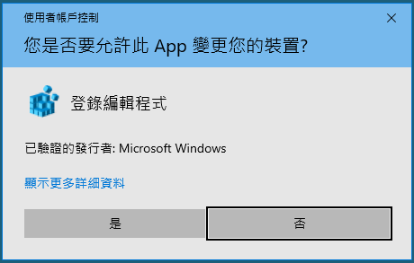

# SQL-Workbench
- [SQL-Workbench](#sql-workbench)
  - [How to run](#how-to-run)
    - [安裝MDAC](#安裝mdac)
    - [安裝ODBC](#安裝odbc)
    - [設定ODBC](#設定odbc)
  - [常見問題](#常見問題)

## How to run

### 安裝MDAC

   ​[安裝步驟](./README/MDAC.md)

### 安裝ODBC	

   [安裝步驟](./README/ODBC.md)

### 設定ODBC

   設定方式有兩種，選擇一種使用即可

   選項1. 透過reg檔案匯入

   1. [下載reg文件](./sql_init.reg)

   2. 執行reg文件並允許UAC

      

   3. 點擊確定

      

   4. 點擊確定完成匯入工作

      

   5. 開啟ODBC資料管理員，如果使用者資料來源有**`AI-Foundry`**那麼匯入成功

      

   選項2. 手動新增OODBC設定

   6. 開啟ODBC資料管理員，選擇使用者資料來源名稱，點擊新增

      

   7. 選擇MySQL ODBC Unicode Driver 點擊完成

   8. 在MySQL Connector/ODBC Data Source Configuration 視窗中填入正確的資料庫內容

      **※注意資料來源名稱必須為```AI-Foundry```

      
    9.點擊Test然後將Database設定為```database````
    
      
      
   10. 檢視ODBC資料管理員，如果使用者資料來源有**`AI-Foundry`**那麼匯入成功

      

## 常見問題

   1. 此中的活動內已對鎖 。 檢閱您的信任中心設定, 或連絡您的 IT 統管理員 

      [Microsoft](https://learn.microsoft.com/zh-tw/office/troubleshoot/settings/file-blocked-in-office)

      當您在 Microsoft Office 程式中開啟或儲存檔案時，檔案會被封鎖。 在此情況下，您可能會收到以下類似錯誤訊息：

      - You are attempting to save a file that is blocked by your registry policy setting. (您嘗試儲存由登錄原則設定封鎖的檔案類型。)

      - 您正嘗試開啟已在信任中心內由 [檔案封鎖] 設定封鎖**的檔案類型檔案類型 <>**。

      - 您嘗試開啟以舊版 Microsoft Office 建立的檔案。 登錄原則設定已禁止您使用此版本來開啟此檔案類型。

      - You are attempting to save a file that is blocked by your registry policy setting. (您嘗試儲存由登錄原則設定封鎖的檔案類型。)

      - 您正嘗試在信任中心儲存已由 [檔案封鎖] 設定封鎖**的檔案類型檔案類型 <>**。

        ##### 解決方案

        方案1

         1. 選取 [檔案選項]>。

            如果無法在 Office 中開啟檔案，請開啟空白文件以啟動 Office 應用程式。 例如：若無法開啟 Word 檔案，請使用 Word 2016 或以上版本開啟新的文件以查看選項。

         2. 在 [選項] 視窗中，依序按一下 [信任中心]> [信任中心設定]。

         3. 在 [信任中心] 視窗中，按一下 [檔案封鎖設定]，然後針對欲開啟或儲存的檔案類型，取消勾選 [開啟] 或 [儲存] 核取方塊。

         4. 選取兩次 [確定]。

         5. 嘗試再次開啟或儲存遭到封鎖的檔案。

        方案2

         1. 對accdb點擊右鍵>內容

            

         2. 勾選一般>安全性中的解除封鎖

            

        

         

   2. 您輸入作為事件性設定的運算式 On Click 產生如下誤 : 當 Microsoft Access 和 OLE 伺服器或 ActiveX 控制項通訊時發生問題

      由於系統是採用CP950編碼，若您的電腦並非採用CP950編碼，則會造成錯誤

      

      ##### 解決方案

         1. 開啟控制台>地區>系統管理>非Unicode程式的語言>變更系統地區設定

            

         2. 將目前的系統地區設定改為繁體中文(台灣)

            

         3. 儲存您的工作階段並選擇立即重新啟動

         
