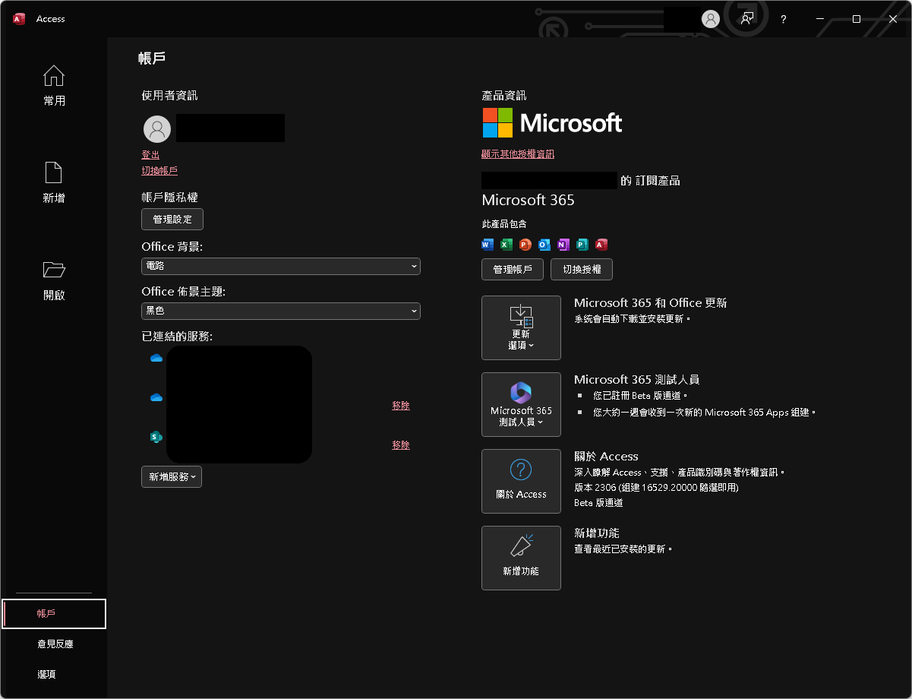
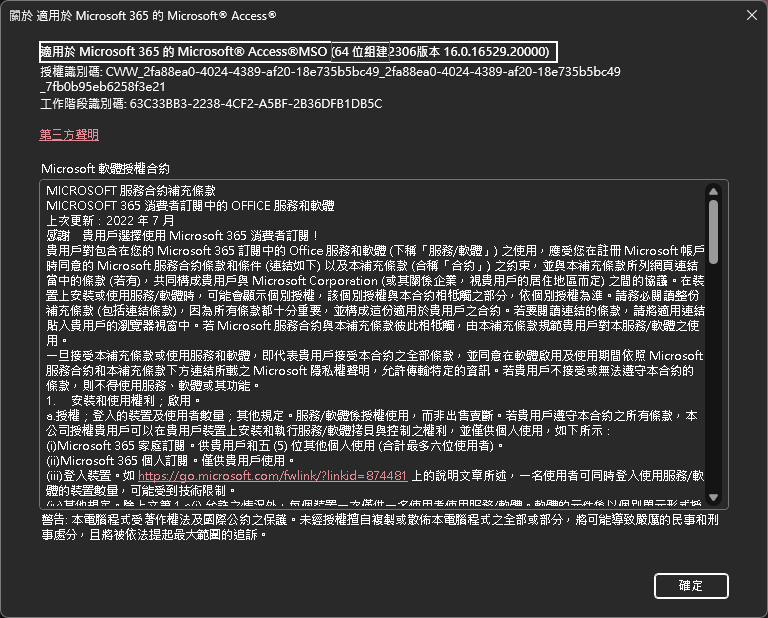
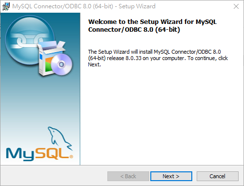
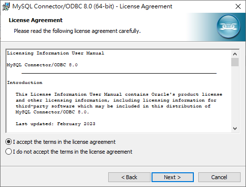
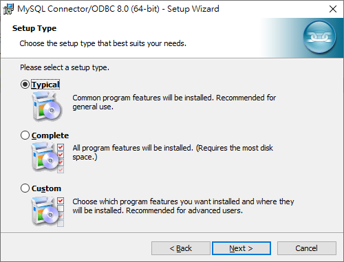
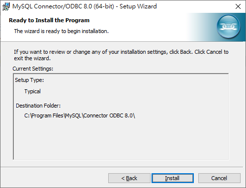
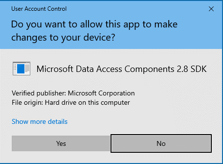
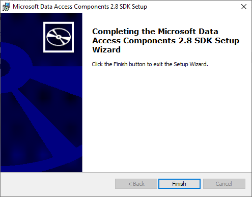

# MySQL Connector/ODBC (ODBC )安裝步驟

[TOC]

## 環境確認

確保已經安裝Microsoft Office，且包含Microsoft Access，若尚未安裝請前往[官方網站](www.office.com)安裝

開啟Access後前往 帳戶>關於Access 確定自己的組件，如下圖所示

## 安裝

1. 前往[MySQL官方網站](https://dev.mysql.com/downloads/connector/odbc/)下載ODBC

   - [64位元](https://dev.mysql.com/get/Downloads/Connector-ODBC/8.0/mysql-connector-odbc-8.0.33-winx64.msi)
   - [32位元](https://dev.mysql.com/get/Downloads/Connector-ODBC/8.0/mysql-connector-odbc-8.0.33-win32.msi)

2. 執行並點擊下一步

   

3. 同意條款並繼續

   

4. 選擇 typical然後下一步

   

5. 選擇安裝

   

6. 如果*Windows* UAC 要求相關權限，請同意	

   

7. 點選完成結束安裝程式

   
